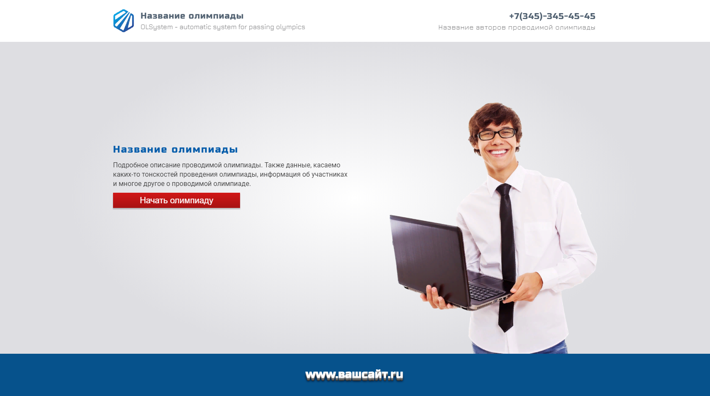
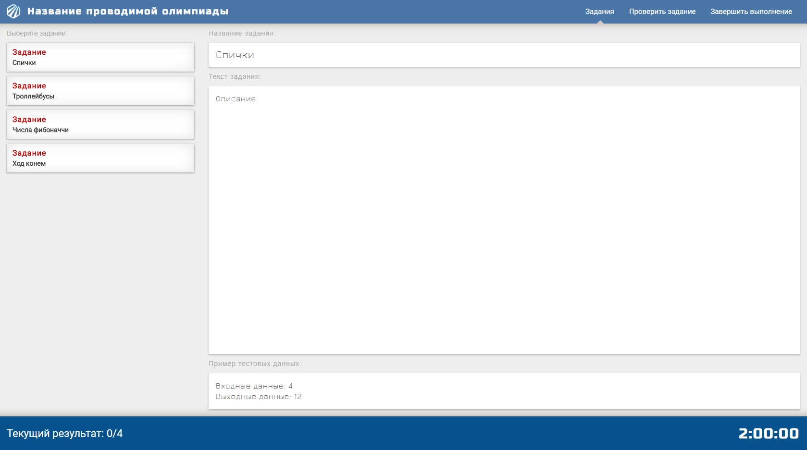
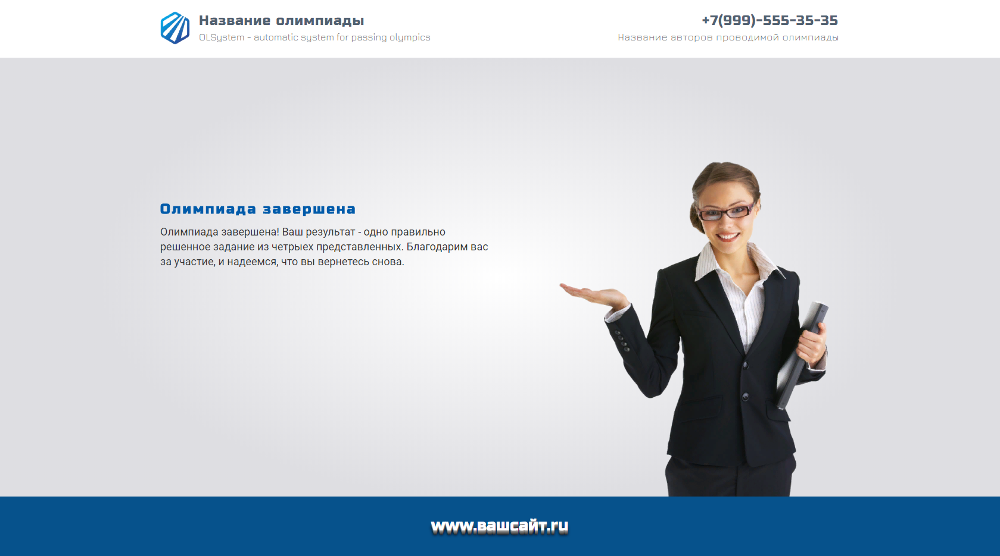
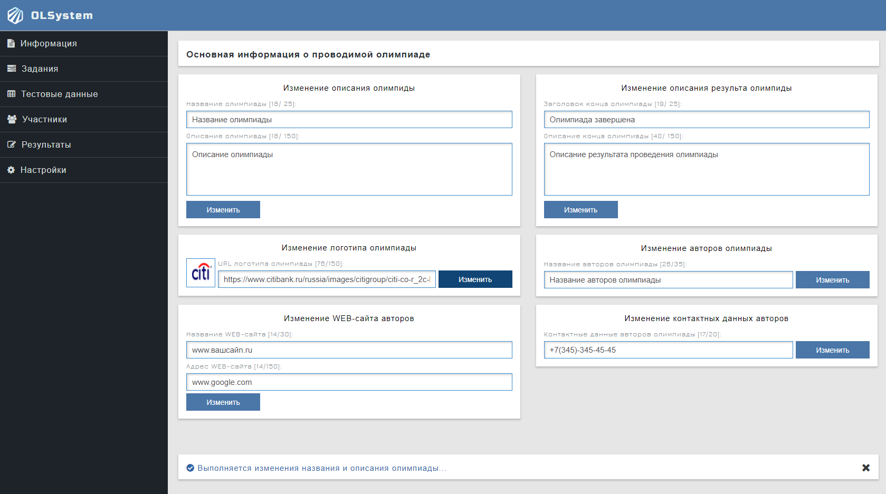
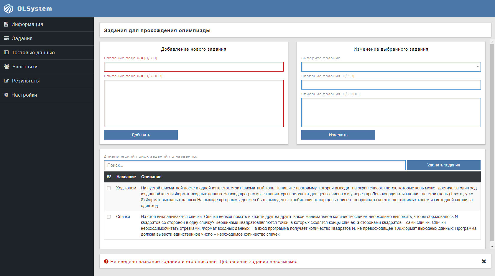
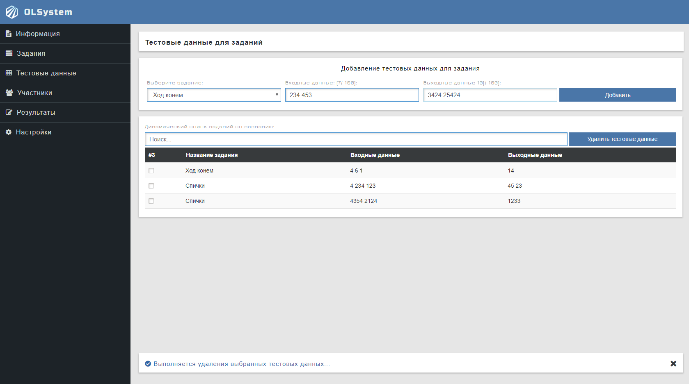
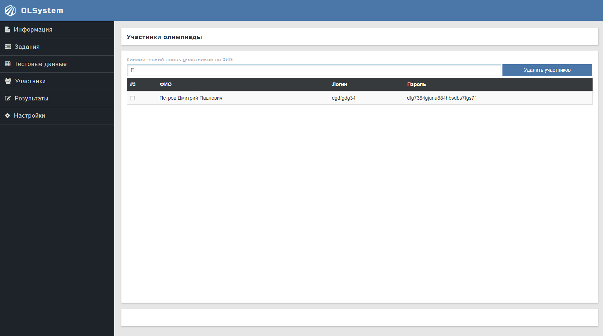
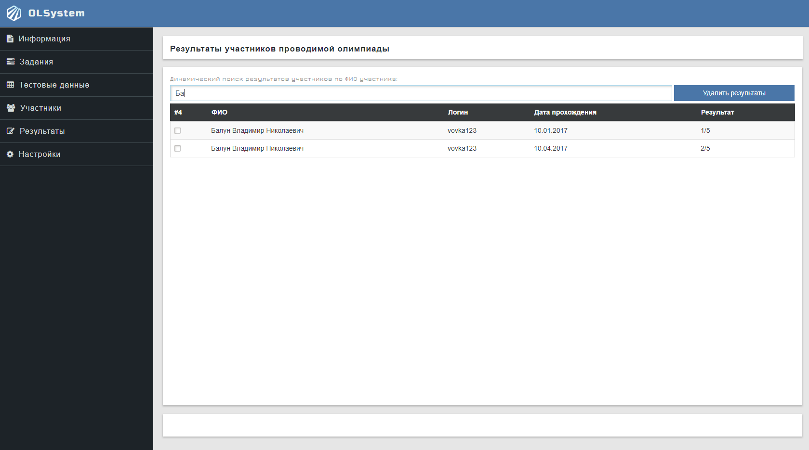
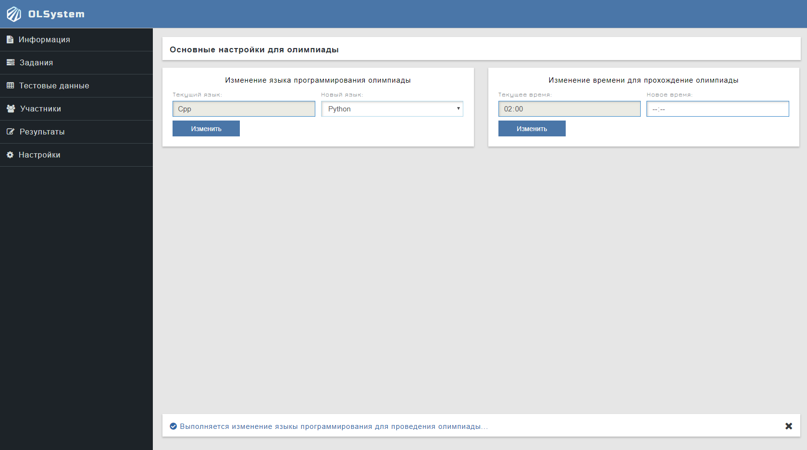

## Graphical user interface of OLSystem

- #### Start page of Olympiad

Current page contains information about Olympiad(name, description,
contacts, icon of Olympiad, website etc.) and it processes authentication 
users.

 

 

____

- #### Page of Olympiad

On this page participants pass the Olympiad. Here, the user is presented 
with a list of tasks for him, his statistics and the remaining time 
until the end of the Olympiad. Also on the other tab, the user is presented 
with all of his events during the Olympiad, and a form for sending tasks 
for checking.

 

 

____

- #### Page of the end of the Olympiad

Current page contains information about Olympiad, and also displays the 
result of the passage to the user.

 

____

- #### Administrator room of OLSystem

Administrator room for changing of conducting Olympiad, in which administrator can:

- change basic information about conducting Olympiad(title, description, creators and much more); 
- add, remove and change tasks for participants;
- change programming language of Olympiad;
- change time for the that is given for the passage olympiad;
- remove outdated participants;
- observe for the results of the all participants.

 

 

 

 

 

 
